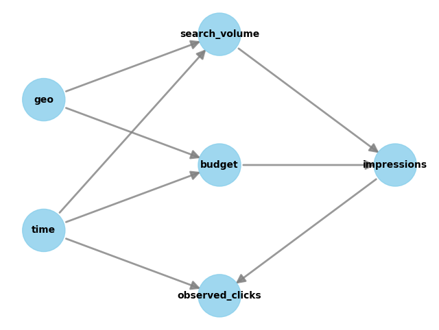

# Search Prediction


<!-- WARNING: THIS FILE WAS AUTOGENERATED! DO NOT EDIT! -->

``` python
model = dowhy.CausalModel(
    data=data.to_dataframe(),
    graph=causal_graph.replace("\n", " "),
    treatment="budget",
    outcome="observed_clicks",
)
model.view_model()
```


