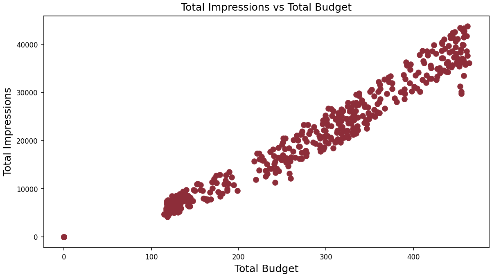
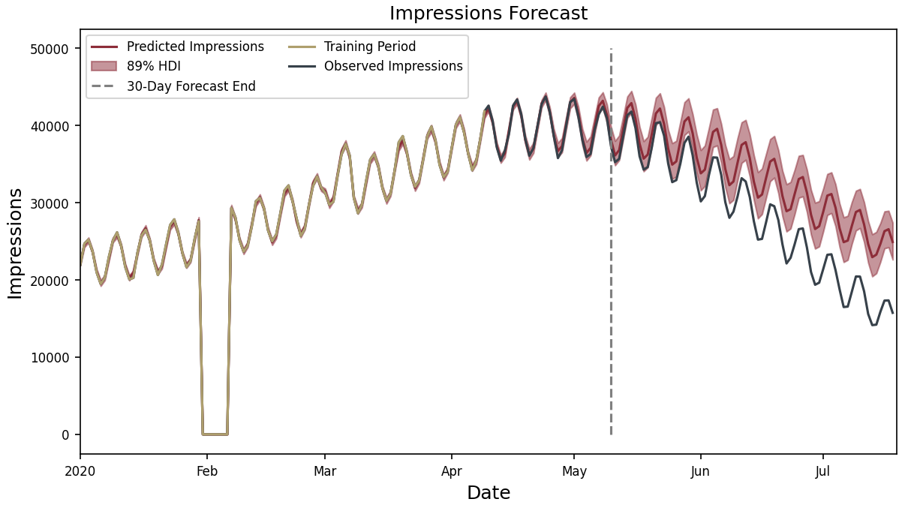
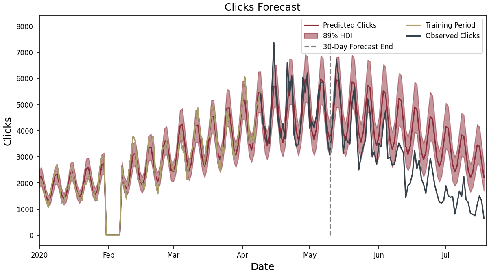

# Search Forecasting


<!-- WARNING: THIS FILE WAS AUTOGENERATED! DO NOT EDIT! -->

This document presents a formal analysis of our probabilistic search
advertising model, demonstrating how it effectively captures the
relationship between marketing expenditure and business outcomes. Using
synthetic data that mirrors real-world advertising patterns, we
illustrate the model’s structure, statistical properties, and practical
applications for optimizing advertising investments.

## Introduction: The Search Advertising Journey

Search advertising represents a complex ecosystem where multiple factors
interact to determine your business outcomes. At its core, the process
follows this path:

1.  **Users search** for terms related to your products or services
2.  **Your budget** competes for visibility among these searches
3.  **Impressions** are generated when your ads appear in search results
4.  **Users click** on a portion of these impressions, driving traffic
    to your site

While this flow seems straightforward, accurately modeling and
predicting these relationships is challenging. Traditional approaches
often make simplistic assumptions that don’t capture real-world
complexities:

- **Linear models** incorrectly assume doubling your budget doubles your
  results
- **Single-factor models** miss the interplay between seasonality,
  geography, and competition
- **Deterministic approaches** fail to account for inherent uncertainty
  in user behavior

Our Bayesian hierarchical model overcomes these limitations by
respecting the true causal structure of search advertising and
quantifying uncertainty at each step.

## The Causal Structure: Understanding What Drives What

The foundation of our model is a causal graph that represents how
different variables influence each other:


This causal structure encodes several key insights:

- **Search volume** is determined by time (seasonality) and geographic
  factors, **not** by your budget
- **Budget** directly influences impressions but has no direct effect on
  search volume
- **Impressions** are constrained by both budget and available search
  volume
- **Clicks** come only from impressions, with rates influenced by time
  and geography

This separation of factors you control (budget) from those you don’t
(market demand) provides clarity about what marketing levers you can
pull and their expected effects.

## The Data: What We’re Modeling

To demonstrate the model, let’s examine some synthetic data that
captures typical patterns in search advertising:

<div class="panel-tabset">

## Search Volume

**The Market Opportunity**


Search volume represents the total market opportunity—how many people
are searching for relevant terms. Notice in
<a href="#fig-avg-search-volume" class="quarto-xref">Figure 2</a>:

- **Annual seasonality**: In this example, peak volume occurs around
  April-May with lowest volume in September
- **Weekly cycles**: Regular oscillations show higher weekday searches
  and weekend drops
- These patterns exist **regardless of your advertising budget**

## Budget Allocation

**Your Strategic Decisions**


Budget allocation shows how you’re distributing your advertising spend:

- **Varying levels** across different geographic regions
- **Seasonal adjustments** that often (but not always) mirror search
  volume patterns
- **Strategic pauses** where budget drops to zero in specific regions

## Impressions

**Your Market Visibility**


Impressions represent how many times your ads appear in search results:

- **Seasonal patterns** similar to search volume
- **Sharp drops to zero** when budget is paused
- **Immediate recovery** when budget resumes

## Clicks

**Your success rate**


Observed clicks tend to have a seasonal and yearly patternd driven by
the effects of search volume, search impressions and consumer behaviors.
Notice:

- Clicks drop to zero when impressions drop to zero
- Strong seasonal patterns are present at both weekly and yearly levels

</div>

### The Budget-Results Relationship: Diminishing Returns

The relationship between budget and results (clicks/impressions) is
clearly non-linear:

- **Initial slow growth**: At low budget levels (100-200), each
  additional dollar yields modest increases
- **Acceleration phase**: At middle budget ranges (200-300), returns
  improve
- **Diminishing returns**: At higher levels (400+), additional spending
  faces decreasing efficiency
- **Variability**: Even at the same budget level, results vary due to
  seasonal factors

This non-linear pattern reflects real-world marketplace dynamics, where
competition and saturation limit the effectiveness of additional
spending.

<div class="panel-tabset">

## Budget-Impressions



## Click Response to Budget


</div>

## The Model Structure: Four Interconnected Components

Our forecasting system models this process through 4 interconnected
components, each with its own statistical approach:

1.  **Defining Inputs and Statistical Controls**
    - Build components for **seasonality** and **trends**
    - Account for different base levels for different **geographies**
    - Add noise to account for shocks
2.  **Search Volume Forecasting**
    - Projects underlying market demand independent of your advertising
    - Accounts for both weekly cycles and yearly seasonality
    - Adjusts for geographic differences in search behavior
3.  **Impression Generation**
    - Models how your budget converts search volume into impressions
    - Captures the “hill function” effect where budget increases face
      diminishing returns
    - Identifies periods of zero impressions when budget is paused
4.  **Click-Through Prediction**
    - Estimates conversion from impressions to valuable clicks
    - Accounts for seasonal variations in consumer engagement
    - Reflects geographic differences in click behavior

### 1. Defining Inputs and Statistical Controls

Looking at the causal graph
(<a href="#fig-causal-graph" class="quarto-xref">Figure 1</a>), we can
see how information flows through the model:

1.  **External Factors First**: Time and geography are the foundation
    variables that influence everything else
2.  **Search Volume Generation**: These external factors determine how
    many people search for relevant terms
3.  **Budget Allocation**: Your marketing spend determines what portion
    of searches become impressions
4.  **Conversion Process**: Impressions then convert to clicks based on
    various factors

This structure accurately represents real-world advertising dynamics
where you can control your budget but not consumer search behavior.

    # Date to be used as a time index in the model 
    time_data = Data('time', dims=('date')) 

    # Budget to be used as a covariate in the model
    budget_data = Data('budget', dims=('date', 'geo'))

Statistical controls can be used when data or theory is not available to
ascribe cause to any particular variable. They allow use to seperate
noise and things outside our control from the factors we are interested
in studying (budget allocation). If theory suggests other explanatory
variables for which data is available that explain the variation in the
data they should be used instead.

    # Length scale prior for the long-term periodicity
    # The length scale defines the smoothness of the periodic function
    # A small length scale means that the function will vary quickly, 
    # while a large length scale means that the function will vary slowly
    # The length scale is a hyperparameter that can be learned from the data
    # Because the length scale is positive, we use a gamma prior
    ls_long_periodic = Prior(
        'ls_lp', 
        prior_name="Gamma", 
        alpha=1, 
        beta=1/5
    )

    # Scale prior for the long-term periodicity
    # The scale defines the amplitude of the periodic function
    # A small scale means that the function will be small,
    # while a large scale means that the function will be large
    # The scale is a hyperparameter that can be learned from the data
    # Because the scale is positive and it may be large, we use an exponential prior
    scale_long_periodic = Prior(
        'scale_lp',
        prior_name="Exponential",
        lam=1/100.0)

    # A Gaussian process prior for the long-term periodicity
    # This prior is used to model time-varying effects
    # This allows for the model to capture long-term trends in the data
    long_periodic = HSGPPeriodic(
        "long_term_periodic",
        m=40, # Rank of the GP approximation
        ls=ls_long_periodic,
        scale=scale_long_periodic,
        dims=('date', 'geo'), # Varies by date and geo
        period=365 # yearly 
    )

    # Hyperparameters for the long-term periodicity prior for CTR
    ls_long_periodic_ctr = Prior(
        "ls_lp_ctr",
        prior_name="Gamma", 
        alpha=1, 
        beta=1/5
        )
    scale_long_periodic_ctr = Prior(
        "scale_lp_ctr", 
        prior_name="Exponential", 
        lam=1
        )

    long_periodic_ctr = HSGPPeriodic(
        "long_term_periodic_ctr",
        m=40,
        ls=ls_long_periodic_ctr,
        scale=scale_long_periodic_ctr,
        dims=('date', 'geo'),
        period=365 # yearly
    )

    # Weekly periodic component
    weekly_periodic = WeeklyFourier(
        name='weekly_periodic',
        n_order=3, # Number of Fourier basis functions to use
        prefix='weekly_search_volume',
        dims=('date',)
        )

``` code-annotation-code
ls_short_periodic = Prior("ls_sp", prior_name="Gamma", alpha=1, beta=1/30)
scale_short_periodic = Prior("scale_sp", prior_name="Exponential", lam=1)

short_periodic_ctr= HSGPPeriodic(
    "short_term_periodic_ctr",
    m=40,
    ls=ls_long_periodic,
    scale=scale_long_periodic,
    dims=('date', 'geo'),
    period=7 # weekly
)
```

    # Average search volume over all geographies
    mean_search_volume = Prior(
                "base_volume_mu", 
                prior_name="Normal", 
                mu=22000, 
                sigma=8000
    )

    # Hyperparameters for the amount of pooling between geographies
    amount_of_pooling_volume = Prior(
            "base_volume_sigma", 
            prior_name="HalfNormal", 
            sigma=500
    )

    # Random effects by geo for the search volume
    volume_random_effects = Prior(
            "base_volume_random_effects",
            prior_name="Normal",
            mu=0,
            sigma=amount_of_pooling_volume,
            dims=('geo',)
        )

    base_volume = (mean_search_volume + volume_random_effects)

    daily_geo_shocks_search_volume = Prior(
            "daily_geo_shocks_search_volume",
            prior_name="Normal", 
            mu=0, 
            sigma=Prior(
                "daily_geo_shocks_search_volume_scale", 
                prior_name="HalfCauchy", 
                beta=1
            ), 
            dims=('date', 'geo')
        )

### 2. Search Volume Component

This predicts the underlying market demand:

- **Base Volume**: A normal distribution representing the average search
  volume for each geographic region
  <a href="#lst-geo-effects-volume" class="quarto-xref">Code 6</a>
- **Temporal Patterns**:
  - Weekly seasonal components (captured by Fourier series
    <a href="#lst-weekly-periodic" class="quarto-xref">Code 4</a>)
  - Long-term periodic components (captured by Hilbert Space Gaussian
    Processes
    <a href="#lst-long-term-periodic" class="quarto-xref">Code 2</a>)
- **Geographic Variations**: Random effects that account for differences
  between markets
  <a href="#lst-geo-effects-volume" class="quarto-xref">Code 6</a>
- **Daily Shocks**: Random variations that capture unexpected search
  behavior fluctuations
  <a href="#lst-volume-shocks" class="quarto-xref">Code 7</a>

The model assumes search volume follows a Poisson distribution, which is
ideal for count data and allows for appropriate variance as volume
increases.
<a href="#lst-search-volume-model-obs" class="quarto-xref">Code 9</a>

    # The mean search volume must be positive, so we use a softplus transformation 
    # an exponential transformation could also be used but then all the priors must be 
    # in the log domain
    # The softplus transformation is a smooth approximation of the ReLU function
    search_volume_lam = ((
        long_periodic 
        + weekly_periodic
        + base_volume
        + daily_geo_shocks_search_volume
        )(time_data)).transform(pt.softplus)

    with pm.Model(coords=coords) as search_model:
        lam = handle_dims(
            search_volume_lam.apply(time_index), 
            search_volume_lam._dims, 
            ("date", "geo")
        )
        search_volume_obs = pm.Poisson(
            "search_volume_obs",
            mu=lam,
            dims=("date", "geo"),
        )

<div>

> **Key assumptions and justifications:**
>
> - **Poisson distribution** for search volume: Appropriate for count
>   data with variance proportional to the mean
> - **Gaussian Process priors** for seasonality: Allows flexible
>   modeling of complex patterns without rigid assumptions
> - **Hierarchical structure** for geographic effects: Shares
>   information across regions while allowing for differences
> - **Additive components**: Each factor (weekly patterns, yearly
>   seasonality, etc.) contributes independently to the overall trend

</div>

<div class="panel-tabset">

## Simulated Search Volume


## Average Simulated Search Volume and Prediction Interval


</div>

### 3. Impression Generation Model

This component converts search volume to impressions based on your
budget:

- **Budget Effect**: Uses a weighted hill function (shown in the code as
  `budget_transform(multiplier, competitor_pressure, budget)`
  <a href="#lst-nonlinear-transform" class="quarto-xref">Code 11</a>)
- **Competitor Pressure**: A Half-Cauchy distribution parameter that
  models how difficult it is to win impressions
  <a href="#lst-budget-model-priors" class="quarto-xref">Code 10</a>
- **Impression Rate**: The probability that a search will result in your
  ad being shown
  <a href="#lst-impression-rate-model" class="quarto-xref">Code 12</a>
- **Final Impressions**: Modeled as a Binomial distribution (either
  shown or not shown)
  <a href="#lst-obs-impression-model" class="quarto-xref">Code 13</a>

This structure captures the diminishing returns seen in
<a href="#fig-imp-response" class="quarto-xref">Figure 6</a>, <a href="#fig-click-response" class="quarto-xref">Figure 7</a>,
where doubling your budget doesn’t double your results.

    # The max precentage of search volume that can be converted to impressions
    # Must be between 0 and 1
    multiplier = Prior(
        "search_volume_multiplier", 
        prior_name="Beta", 
        alpha=0.5, 
        beta=0.5, 
        dims=tuple()
        )

    # The average competitive pressure for bidded keywords
    # This can be modeled by keword category, by geo and time
    # It is assumed constant for simplicity
    # Must be positive but can be large
    competitor_pressure = Prior(
        "competitor_pressure", 
        prior_name="HalfCauchy", 
        beta=1, 
        dims=tuple()
        )

    def budget_transform(multiplier, competitor_pressure, budget):
        numerator = multiplier * budget
        denominator = budget + competitor_pressure
        return numerator / denominator

    impression_rate = budget_transform(
        multiplier=multiplier,
        competitor_pressure=competitor_pressure,
        budget=budget_data
    )

    with search_model:
        imp_rate = handle_dims(
            impression_rate.apply(obs_budget_data), 
            impression_rate._dims, 
            ("date", "geo"))
        impressions_obs = pm.Binomial(
            "impressions_obs",
            n=search_volume_obs,
            p=imp_rate,
            dims=("date", "geo"),
        )

<div>

> **Key assumptions and justifications:**
>
> - **Hill function** for budget effects: Creates an S-shaped curve that
>   realistically models marketplace dynamics
> - **Competitor pressure parameter**: Captures how difficult it is to
>   win impression share in competitive markets
> - **Binomial distribution** for impressions: Models the binary outcome
>   (shown/not shown) for each potential search
> - **Upper bound** constrained by search volume: You can’t get more
>   impressions than there are searches

</div>

<div class="panel-tabset">

## Prior Simulated Impressions


## Average Impressions


</div>

### 4. Click-Through Rate Model

This predicts how impressions convert to clicks:

- **Base CTR**: The fundamental click probability
  <a href="#lst-ctr-model" class="quarto-xref">Code 14</a>
- **Temporal CTR Patterns**:
  - Short-term periodic effects (customer behavior trends)
    <a href="#lst-ctr-model" class="quarto-xref">Code 14</a>
  - Long-term periodic effects (seasonal buying patterns)
    <a href="#lst-ctr-model" class="quarto-xref">Code 14</a>
- **Final Clicks**: Modeled as a Binomial distribution based on these
  probabilities
  <a href="#lst-obs-click-model" class="quarto-xref">Code 15</a>

<!-- -->

    base_ctr = Prior(
        "base_ctr", 
        prior_name="Normal", 
        mu=0, 
        sigma=1
    )

    noise = Prior(
        "ctr_noise", 
        prior_name="Normal", 
        sigma=Prior(
            "ctr_noise_scale", 
            prior_name="HalfNormal", 
            sigma=.01,
            dims=tuple()
        ),
        dims=("date",)
    )

    ctr = ((
        short_periodic_ctr 
        + long_periodic_ctr 
        + base_ctr
        + noise
    )(time_data)
    ).transform(pt.sigmoid)

    with search_model:
        ctr = handle_dims(
            ctr.apply(obs_budget_data), 
            ctr._dims, 
            ("date", "geo"))
        clicks_obs = pm.Binomial(
            "clicks_obs",
            n=impressions_obs,
            p=ctr,
            dims=("date", "geo"),
        )

<div>

> **Key assumptions and justifications:**
>
> - **Sigmoid transformation**: Ensures click probabilities stay between
>   0 and 1
> - **Binomial distribution** for clicks: Models the binary outcome
>   (clicked/not clicked) for each impression
> - **Temporal components**: Captures how user behavior varies by day of
>   week and season
> - **Hierarchical structure**: Allows for geographic differences in
>   click behavior

</div>

<div class="panel-tabset">

## Prior Simulated Clicks


## Average Clicks


</div>

## The Complete Probabilistic Model

The full model integrates all these components in a Bayesian framework:


This probabilistic approach offers several advantages:

1.  **Uncertainty quantification**: Provides confidence intervals around
    predictions
2.  **Parameter learning**: Infers key parameters like competitor
    pressure from your historical data
3.  **Future forecasting**: Projects expected performance under
    different budget scenarios
4.  **Anomaly detection**: Identifies when performance diverges from
    expectations

## Fitting the Model

``` python
def partial_observe(model, obs_data, input_data, coords, target_accept=.70):
    with pm.observe(model, obs_data):
        pm.set_data(input_data, coords=coords)
        trace = pm.sample(1000, tune=1000, target_accept=target_accept, nuts_sampler='nutpie')
    return trace

search_volume_trace = partial_observe(
    search_model, 
    {'search_volume_obs': train_data.search_volume.values,
    'impressions_obs': train_data.impressions.values,
    'clicks_obs': train_data.observed_clicks.values}, 
    {'time': train_data['time'].values,
    'budget': train_data.budget.values}, 
    coords,
    target_accept=.95
    )
```

<style>
    :root {
        --column-width-1: 40%; /* Progress column width */
        --column-width-2: 15%; /* Chain column width */
        --column-width-3: 15%; /* Divergences column width */
        --column-width-4: 15%; /* Step Size column width */
        --column-width-5: 15%; /* Gradients/Draw column width */
    }
&#10;    .nutpie {
        max-width: 800px;
        margin: 10px auto;
        font-family: 'Segoe UI', Tahoma, Geneva, Verdana, sans-serif;
        //color: #333;
        //background-color: #fff;
        padding: 10px;
        box-shadow: 0 4px 6px rgba(0,0,0,0.1);
        border-radius: 8px;
        font-size: 14px; /* Smaller font size for a more compact look */
    }
    .nutpie table {
        width: 100%;
        border-collapse: collapse; /* Remove any extra space between borders */
    }
    .nutpie th, .nutpie td {
        padding: 8px 10px; /* Reduce padding to make table more compact */
        text-align: left;
        border-bottom: 1px solid #888;
    }
    .nutpie th {
        //background-color: #f0f0f0;
    }
&#10;    .nutpie th:nth-child(1) { width: var(--column-width-1); }
    .nutpie th:nth-child(2) { width: var(--column-width-2); }
    .nutpie th:nth-child(3) { width: var(--column-width-3); }
    .nutpie th:nth-child(4) { width: var(--column-width-4); }
    .nutpie th:nth-child(5) { width: var(--column-width-5); }
&#10;    .nutpie progress {
        width: 100%;
        height: 15px; /* Smaller progress bars */
        border-radius: 5px;
    }
    progress::-webkit-progress-bar {
        background-color: #eee;
        border-radius: 5px;
    }
    progress::-webkit-progress-value {
        background-color: #5cb85c;
        border-radius: 5px;
    }
    progress::-moz-progress-bar {
        background-color: #5cb85c;
        border-radius: 5px;
    }
    .nutpie .progress-cell {
        width: 100%;
    }
&#10;    .nutpie p strong { font-size: 16px; font-weight: bold; }
&#10;    @media (prefers-color-scheme: dark) {
        .nutpie {
            //color: #ddd;
            //background-color: #1e1e1e;
            box-shadow: 0 4px 6px rgba(0,0,0,0.2);
        }
        .nutpie table, .nutpie th, .nutpie td {
            border-color: #555;
            color: #ccc;
        }
        .nutpie th {
            background-color: #2a2a2a;
        }
        .nutpie progress::-webkit-progress-bar {
            background-color: #444;
        }
        .nutpie progress::-webkit-progress-value {
            background-color: #3178c6;
        }
        .nutpie progress::-moz-progress-bar {
            background-color: #3178c6;
        }
    }
</style>

<div class="nutpie">
    <p><strong>Sampler Progress</strong></p>
    <p>Total Chains: <span id="total-chains">4</span></p>
    <p>Active Chains: <span id="active-chains">0</span></p>
    <p>
        Finished Chains:
        <span id="active-chains">4</span>
    </p>
    <p>Sampling for 5 minutes</p>
    <p>
        Estimated Time to Completion:
        <span id="eta">now</span>
    </p>
&#10;    <progress
        id="total-progress-bar"
        max="8000"
        value="8000">
    </progress>
    <table>
        <thead>
            <tr>
                <th>Progress</th>
                <th>Draws</th>
                <th>Divergences</th>
                <th>Step Size</th>
                <th>Gradients/Draw</th>
            </tr>
        </thead>
        <tbody id="chain-details">
            &#10;                <tr>
                    <td class="progress-cell">
                        <progress
                            max="2000"
                            value="2000">
                        </progress>
                    </td>
                    <td>2000</td>
                    <td>0</td>
                    <td>0.03</td>
                    <td>1023</td>
                </tr>
            &#10;                <tr>
                    <td class="progress-cell">
                        <progress
                            max="2000"
                            value="2000">
                        </progress>
                    </td>
                    <td>2000</td>
                    <td>0</td>
                    <td>0.02</td>
                    <td>1023</td>
                </tr>
            &#10;                <tr>
                    <td class="progress-cell">
                        <progress
                            max="2000"
                            value="2000">
                        </progress>
                    </td>
                    <td>2000</td>
                    <td>0</td>
                    <td>0.03</td>
                    <td>1023</td>
                </tr>
            &#10;                <tr>
                    <td class="progress-cell">
                        <progress
                            max="2000"
                            value="2000">
                        </progress>
                    </td>
                    <td>2000</td>
                    <td>0</td>
                    <td>0.03</td>
                    <td>127</td>
                </tr>
            &#10;            </tr>
        </tbody>
    </table>
</div>

``` python
search_volume_pred = predict_full_period(search_volume_trace)
```

    Sampling: [clicks_obs, ctr_noise, daily_geo_shocks_search_volume, impressions_obs, search_volume_obs]

    Output()

<pre style="white-space:pre;overflow-x:auto;line-height:normal;font-family:Menlo,'DejaVu Sans Mono',consolas,'Courier New',monospace"></pre>

### Forecast Results

<div class="panel-tabset">

## Search Volume


## Search Impressions



## Clicks



</div>

<div>
<style scoped>
    .dataframe tbody tr th:only-of-type {
        vertical-align: middle;
    }
&#10;    .dataframe tbody tr th {
        vertical-align: top;
    }
&#10;    .dataframe thead th {
        text-align: right;
    }
</style>

<table class="dataframe" data-quarto-postprocess="true" data-border="1">
<caption>Posterior estimate for the function parameters relating budget
to impressions.</caption>
<thead>
<tr style="text-align: right;">
<th data-quarto-table-cell-role="th"></th>
<th data-quarto-table-cell-role="th">mean</th>
<th data-quarto-table-cell-role="th">sd</th>
<th data-quarto-table-cell-role="th">hdi_3%</th>
<th data-quarto-table-cell-role="th">hdi_97%</th>
<th data-quarto-table-cell-role="th">mcse_mean</th>
<th data-quarto-table-cell-role="th">mcse_sd</th>
<th data-quarto-table-cell-role="th">ess_bulk</th>
<th data-quarto-table-cell-role="th">ess_tail</th>
<th data-quarto-table-cell-role="th">r_hat</th>
</tr>
</thead>
<tbody>
<tr>
<td data-quarto-table-cell-role="th">search_volume_multiplier</td>
<td>0.251</td>
<td>0.002</td>
<td>0.248</td>
<td>0.254</td>
<td>0.000</td>
<td>0.00</td>
<td>599.0</td>
<td>893.0</td>
<td>1.01</td>
</tr>
<tr>
<td data-quarto-table-cell-role="th">competitor_pressure</td>
<td>30.320</td>
<td>0.415</td>
<td>29.569</td>
<td>31.139</td>
<td>0.017</td>
<td>0.01</td>
<td>592.0</td>
<td>899.0</td>
<td>1.01</td>
</tr>
</tbody>
</table>

</div>

#### Model Updates

``` python
train_data = data.isel(date=slice(None, 200))
updated_coords = {
    "date": train_data.date.values,
    "geo": train_data.geo.values
}
updated_search_volume_trace = partial_observe(
    search_model, 
    {'search_volume_obs': train_data.search_volume.values,
    'impressions_obs': train_data.impressions.values,
    'clicks_obs': train_data.observed_clicks.values}, 
    {'time': train_data['time'].values,
    'budget': train_data.budget.values}, 
    updated_coords,
    target_accept=.95
    )
```

<style>
    :root {
        --column-width-1: 40%; /* Progress column width */
        --column-width-2: 15%; /* Chain column width */
        --column-width-3: 15%; /* Divergences column width */
        --column-width-4: 15%; /* Step Size column width */
        --column-width-5: 15%; /* Gradients/Draw column width */
    }
&#10;    .nutpie {
        max-width: 800px;
        margin: 10px auto;
        font-family: 'Segoe UI', Tahoma, Geneva, Verdana, sans-serif;
        //color: #333;
        //background-color: #fff;
        padding: 10px;
        box-shadow: 0 4px 6px rgba(0,0,0,0.1);
        border-radius: 8px;
        font-size: 14px; /* Smaller font size for a more compact look */
    }
    .nutpie table {
        width: 100%;
        border-collapse: collapse; /* Remove any extra space between borders */
    }
    .nutpie th, .nutpie td {
        padding: 8px 10px; /* Reduce padding to make table more compact */
        text-align: left;
        border-bottom: 1px solid #888;
    }
    .nutpie th {
        //background-color: #f0f0f0;
    }
&#10;    .nutpie th:nth-child(1) { width: var(--column-width-1); }
    .nutpie th:nth-child(2) { width: var(--column-width-2); }
    .nutpie th:nth-child(3) { width: var(--column-width-3); }
    .nutpie th:nth-child(4) { width: var(--column-width-4); }
    .nutpie th:nth-child(5) { width: var(--column-width-5); }
&#10;    .nutpie progress {
        width: 100%;
        height: 15px; /* Smaller progress bars */
        border-radius: 5px;
    }
    progress::-webkit-progress-bar {
        background-color: #eee;
        border-radius: 5px;
    }
    progress::-webkit-progress-value {
        background-color: #5cb85c;
        border-radius: 5px;
    }
    progress::-moz-progress-bar {
        background-color: #5cb85c;
        border-radius: 5px;
    }
    .nutpie .progress-cell {
        width: 100%;
    }
&#10;    .nutpie p strong { font-size: 16px; font-weight: bold; }
&#10;    @media (prefers-color-scheme: dark) {
        .nutpie {
            //color: #ddd;
            //background-color: #1e1e1e;
            box-shadow: 0 4px 6px rgba(0,0,0,0.2);
        }
        .nutpie table, .nutpie th, .nutpie td {
            border-color: #555;
            color: #ccc;
        }
        .nutpie th {
            background-color: #2a2a2a;
        }
        .nutpie progress::-webkit-progress-bar {
            background-color: #444;
        }
        .nutpie progress::-webkit-progress-value {
            background-color: #3178c6;
        }
        .nutpie progress::-moz-progress-bar {
            background-color: #3178c6;
        }
    }
</style>

<div class="nutpie">
    <p><strong>Sampler Progress</strong></p>
    <p>Total Chains: <span id="total-chains">4</span></p>
    <p>Active Chains: <span id="active-chains">0</span></p>
    <p>
        Finished Chains:
        <span id="active-chains">4</span>
    </p>
    <p>Sampling for 8 minutes</p>
    <p>
        Estimated Time to Completion:
        <span id="eta">now</span>
    </p>
&#10;    <progress
        id="total-progress-bar"
        max="8000"
        value="8000">
    </progress>
    <table>
        <thead>
            <tr>
                <th>Progress</th>
                <th>Draws</th>
                <th>Divergences</th>
                <th>Step Size</th>
                <th>Gradients/Draw</th>
            </tr>
        </thead>
        <tbody id="chain-details">
            &#10;                <tr>
                    <td class="progress-cell">
                        <progress
                            max="2000"
                            value="2000">
                        </progress>
                    </td>
                    <td>2000</td>
                    <td>0</td>
                    <td>0.03</td>
                    <td>127</td>
                </tr>
            &#10;                <tr>
                    <td class="progress-cell">
                        <progress
                            max="2000"
                            value="2000">
                        </progress>
                    </td>
                    <td>2000</td>
                    <td>0</td>
                    <td>0.03</td>
                    <td>1023</td>
                </tr>
            &#10;                <tr>
                    <td class="progress-cell">
                        <progress
                            max="2000"
                            value="2000">
                        </progress>
                    </td>
                    <td>2000</td>
                    <td>0</td>
                    <td>0.03</td>
                    <td>127</td>
                </tr>
            &#10;                <tr>
                    <td class="progress-cell">
                        <progress
                            max="2000"
                            value="2000">
                        </progress>
                    </td>
                    <td>2000</td>
                    <td>0</td>
                    <td>0.02</td>
                    <td>1023</td>
                </tr>
            &#10;            </tr>
        </tbody>
    </table>
</div>

``` python
updated_search_volume_pred = predict_full_period(updated_search_volume_trace)
```

    Sampling: [clicks_obs, ctr_noise, daily_geo_shocks_search_volume, impressions_obs, search_volume_obs]

    Output()

<pre style="white-space:pre;overflow-x:auto;line-height:normal;font-family:Menlo,'DejaVu Sans Mono',consolas,'Courier New',monospace"></pre>

<div class="panel-tabset">

## Search Volume


## Impressions


## Clicks


</div>

## Practical Applications: Optimizing Your Strategy

This model supports several critical business decisions:

### Budget Optimization

- **Finding the inflection point**: Identify where additional spending
  faces significantly diminishing returns
- **Scenario testing**: Predict outcomes from different budget levels
  before committing resources

### Geographic Allocation

- **Market efficiency comparison**: Identify which regions provide
  better returns on ad spend
- **Reallocation strategies**: Shift budget from saturated to more
  responsive markets

### Seasonal Planning

- **Preemptive adjustments**: Increase budget before seasonal demand
  spikes
- **Efficiency preservation**: Reduce spending during predictable
  low-volume periods

### Anomaly Detection

- **Performance monitoring**: Identify when actual results deviate from
  expectations
- **Competitive intelligence**: Detect when marketplace dynamics change
  significantly

## Limitations and Considerations

Like all models this one is wrong, so it is important to understand the
assumptions this model makes:

1.  **Competitor behavior assumptions**: The model assumes competitor
    pressure changes slowly; rapid competitive shifts may reduce
    forecast accuracy

2.  **Market disruptions**: Major external events (like a pandemic) may
    invalidate historical patterns

3.  **New market limitations**: Limited historical data for new
    geographic regions may reduce forecast accuracy initially

4.  **Attribution windows**: The model assumes clicks are attributed to
    impressions within the same time window

This model is designed to be modular, so if any of these assumptions are
violated in such a way that the model is no longer useful it can be
ammended.

## Next Steps: Implementing the Model

To implement this model for your business:

1.  **Data integration**: Connect your search advertising platform data
2.  **Historical fitting**: Train the model on your past performance
3.  **Scenario planning**: Test different budget allocation strategies
4.  **Continuous refinement**: Update the model as new data becomes
    available

## Conclusion: The Value of Sophisticated Modeling

Traditional approaches to search advertising often rely on simplistic
assumptions that don’t capture real-world complexity. This probabilistic
model overcomes these limitations by:

- **Respecting causal structure**: Distinguishing what you control from
  what you don’t
- **Capturing non-linearity**: Modeling diminishing returns and
  saturation effects
- **Accounting for uncertainty**: Providing confidence intervals around
  predictions
- **Integrating multiple factors**: Combining seasonality, geography,
  and marketplace dynamics

This sophisticated approach provides more accurate forecasts and enables
smarter budget allocation decisions across time periods and geographic
markets.
