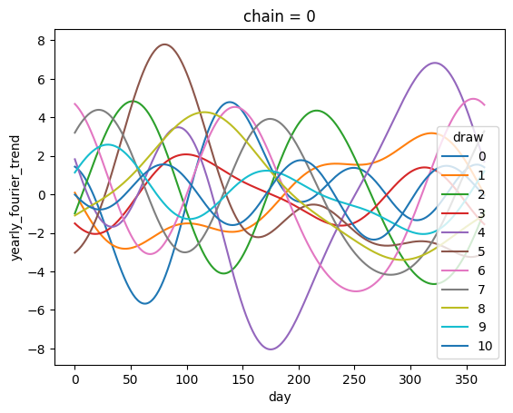

# PyMC Wrapper


<!-- WARNING: THIS FILE WAS AUTOGENERATED! DO NOT EDIT! -->

------------------------------------------------------------------------

<a
href="https://github.com/redam94/search-forecast/blob/main/search_forecast/wrapper/pymc_wrapper.py#L265"
target="_blank" style="float:right; font-size:smaller">source</a>

### HSGP

>  HSGP (name:str, **kwargs)

*Generalized prior interface for pymc-marketing. This generalizes the
use of the apply method to any prior.*

``` python
hspg = HSGP(
    "hspg",
    m=40,
    ls=1,
    eta=3,
    L=60,
    dims=("date",)
)
```

------------------------------------------------------------------------

<a
href="https://github.com/redam94/search-forecast/blob/main/search_forecast/wrapper/pymc_wrapper.py#L292"
target="_blank" style="float:right; font-size:smaller">source</a>

### HSGPPeriodic

>  HSGPPeriodic (name:str, **kwargs)

*Generalized prior interface for pymc-marketing. This generalizes the
use of the apply method to any prior.*

------------------------------------------------------------------------

<a
href="https://github.com/redam94/search-forecast/blob/main/search_forecast/wrapper/pymc_wrapper.py#L319"
target="_blank" style="float:right; font-size:smaller">source</a>

### YearlyFourier

>  YearlyFourier (name:str, **kwargs)

*Generalized prior interface for pymc-marketing. This generalizes the
use of the apply method to any prior.*

``` python
yearly_fourier = YearlyFourier(
    name="yearly_fourier",
    n_order=3,
    dims=("date",),
)
```

------------------------------------------------------------------------

### FourierBase.sample_prior

>  FourierBase.sample_prior (coords:dict|None=None, **kwargs)

*Sample the prior distributions.*

<table>
<colgroup>
<col style="width: 6%" />
<col style="width: 25%" />
<col style="width: 34%" />
<col style="width: 34%" />
</colgroup>
<thead>
<tr>
<th></th>
<th><strong>Type</strong></th>
<th><strong>Default</strong></th>
<th><strong>Details</strong></th>
</tr>
</thead>
<tbody>
<tr>
<td>coords</td>
<td>dict | None</td>
<td>None</td>
<td>Coordinates for the prior distribution, by default None</td>
</tr>
<tr>
<td>kwargs</td>
<td>VAR_KEYWORD</td>
<td></td>
<td>Additional keywords for sample_prior_predictive</td>
</tr>
<tr>
<td><strong>Returns</strong></td>
<td><strong>Dataset</strong></td>
<td></td>
<td><strong>Prior distribution.</strong></td>
</tr>
</tbody>
</table>

------------------------------------------------------------------------

### FourierBase.sample_curve

>  FourierBase.sample_curve (parameters:arviz.data.inference_data.InferenceD
>                                ata|xarray.core.dataset.Dataset,
>                                use_dates:bool=False,
>                                start_date:str|datetime.datetime|None=None)

*Create full period of the Fourier seasonality.*

<table>
<colgroup>
<col style="width: 6%" />
<col style="width: 25%" />
<col style="width: 34%" />
<col style="width: 34%" />
</colgroup>
<thead>
<tr>
<th></th>
<th><strong>Type</strong></th>
<th><strong>Default</strong></th>
<th><strong>Details</strong></th>
</tr>
</thead>
<tbody>
<tr>
<td>parameters</td>
<td>arviz.data.inference_data.InferenceData |
xarray.core.dataset.Dataset</td>
<td></td>
<td>Inference data or dataset containing the Fourier parameters.<br>Can
be posterior or prior.</td>
</tr>
<tr>
<td>use_dates</td>
<td>bool</td>
<td>False</td>
<td>If True, use datetime coordinates for the x-axis. Defaults to
False.</td>
</tr>
<tr>
<td>start_date</td>
<td>str | datetime.datetime | None</td>
<td>None</td>
<td>Starting date for the Fourier curve. If not provided and use_dates
is True,<br>it will be derived from the current year or month. Defaults
to None.</td>
</tr>
<tr>
<td><strong>Returns</strong></td>
<td><strong>DataArray</strong></td>
<td></td>
<td><strong>Full period of the Fourier seasonality.</strong></td>
</tr>
</tbody>
</table>

``` python
prior_sample = yearly_fourier.sample_prior(coords={"date": np.arange(0, 365)})
curve_sample = yearly_fourier.sample_curve(prior_sample)
curve_sample.sel(chain=0, draw=slice(10)).plot(x='day', hue='draw');
```

    Sampling: [yearly_fourier_beta]
    Sampling: []

    Output()

<pre style="white-space:pre;overflow-x:auto;line-height:normal;font-family:Menlo,'DejaVu Sans Mono',consolas,'Courier New',monospace"></pre>



------------------------------------------------------------------------

<a
href="https://github.com/redam94/search-forecast/blob/main/search_forecast/wrapper/pymc_wrapper.py#L342"
target="_blank" style="float:right; font-size:smaller">source</a>

### WeeklyFourier

>  WeeklyFourier (name:str, **kwargs)

*Generalized prior interface for pymc-marketing. This generalizes the
use of the apply method to any prior.*

------------------------------------------------------------------------

<a
href="https://github.com/redam94/search-forecast/blob/main/search_forecast/wrapper/pymc_wrapper.py#L365"
target="_blank" style="float:right; font-size:smaller">source</a>

### Prior

>  Prior (name:str, **kwargs)

*Generalized prior interface for pymc-marketing. This generalizes the
use of the apply method to any prior.*

------------------------------------------------------------------------

<a
href="https://github.com/redam94/search-forecast/blob/main/search_forecast/wrapper/pymc_wrapper.py#L389"
target="_blank" style="float:right; font-size:smaller">source</a>

### Data

>  Data (name:str, dims:Optional[Tuple[str]]=None)

*Generalized prior interface for pymc-marketing. This generalizes the
use of the apply method to any prior.*
